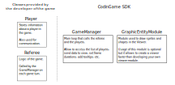

# CodinGame SDK

The CodinGame SDK is a Java project that allows you to write programming games for [CodinGame](https://www.codingame.com).

A game is divided into 2 parts: the **referee** and the **viewer**. The **referee** is a program that implements the game rules. It will communicate with the players and at the end it will assign a score to each player or a win/lose status (depending on which type of game you create). The **viewer** displays the game using *frames* sent by the **referee**.

The CodinGame SDK provides the main classes to write the **referee** and a **viewer**. A module called **GraphicEntityModule** allows the display of sprites and shapes directly from the **referee** code. If you want to do something more advanced, it's possible to write your own module.

# Main Classes

A game must at least contains the classes `Referee` and `Player`, which inherit from the classes `AbstractReferee` and `AbstractMultiplayerPlayer` or `AbstractSoloPlayer` respectively.

The `Referee` class must implement the methods `init` and `gameTurn`. The `Player` class is mainly used to communicate with the agent (you must give the input, then read the output).

The entry point of the game is the class `SoloGameManager` or `MultiplayerGameManager` (corresponding to the type of game you are creating). This class calls the `Referee` on each turn, and sends data to the viewer.

# Resources

- [Javadoc](https://codingame.github.io/codingame-sdk-doc/)
- [SDK source](https://github.com/CodinGame/codingame-game-engine)
- [Free to use graphical assets](https://github.com/CodinGame/codingame-sdk-assets)
- [Game Skeleton](https://github.com/CodinGame/game-skeleton)
- [Contribute Page](https://www.codingame.com/contribute/)